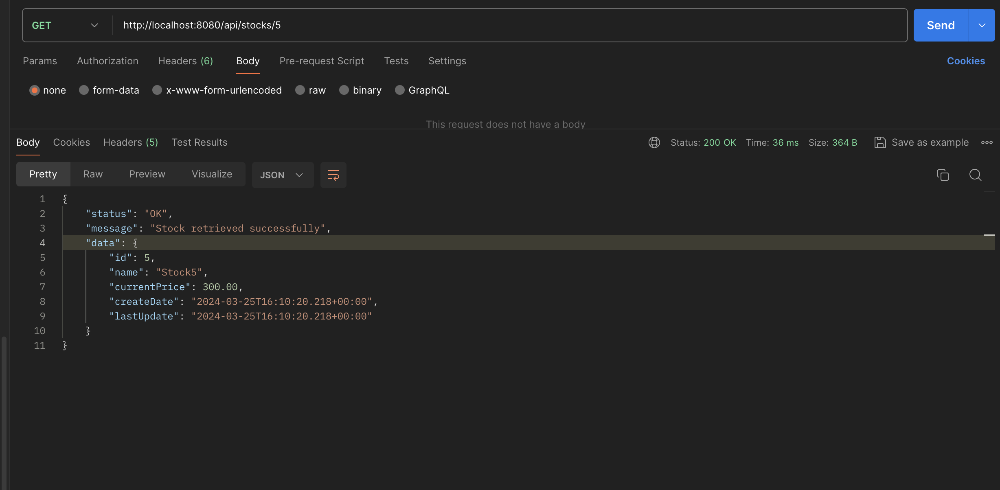

## STOCK API
### Create a Java based backend application using REST. It should contain the following endpoints;
* GET /api/stocks/getAllStocks (get a list of stocks)
* GET /api/stocks/1 (get one stock from the list)
* PUT /api/stocks/updatePrice/1 (update the price of a single stock)
* POST /api/stocks/createStock (create a stock)
### Tools
* Java 17
* Spring Boot
* JUnit/Mockito

---
### Testing the API endpoints
#### Get All Stocks
* GET /api/stocks
```shell
curl -X GET http://localhost:8080/api/stocks/getAllStocks
```
#### Sample Response
```json
{
  "status": "OK",
  "message": "Stocks retrieved successfully",
  "data": [
    {
      "id": 1,
      "name": "Stock1",
      "currentPrice": 100.00,
      "createDate": "2024-03-25T17:47:27.170+00:00",
      "lastUpdate": "2024-03-25T17:47:27.170+00:00"
    },
    {
      "id": 2,
      "name": "Stock2",
      "currentPrice": 200.00,
      "createDate": "2024-03-25T17:47:27.170+00:00",
      "lastUpdate": "2024-03-25T17:47:27.170+00:00"
    }
    ]
}
```

#### Get One Stock
* GET /api/stocks/1
```shell
curl -X GET http://localhost:8080/api/stocks/1
```
#### Sample Response
```json
{
  "status": "OK",
  "message": "Stock retrieved successfully",
  "data": {
    "id": 1,
    "name": "Stock1",
    "currentPrice": 100.00,
    "createDate": "2024-03-25T17:47:27.170+00:00",
    "lastUpdate": "2024-03-25T17:47:27.170+00:00"
  }
}
```

#### Update Stock Price
* PUT /api/stocks/1
```shell
curl -X PUT http://localhost:8080/api/stocks/updatePrice/1 -H "Content-Type: application/json" -d '{"price": 500}'
```
#### Sample Response
```json
{
  "status": "OK",
  "message": "Stock price updated successfully",
  "data": {
    "id": 1,
    "name": "Stock1",
    "currentPrice": 500.00,
    "createDate": "2024-03-25T17:47:27.170+00:00",
    "lastUpdate": "2024-03-25T17:47:27.170+00:00"
  }
}
```

#### Create a Stock
* POST /api/stocks
```shell
curl -X POST http://localhost:8080/api/stocks/createStock -H "Content-Type: application/json" -d '{"name": "Stock 1", "price": 100}'
```
#### Sample Response
```json
{
  "status": "OK",
  "message": "Stock created successfully",
  "data": {
    "id": 3,
    "name": "Stock 1",
    "currentPrice": 100.00,
    "createDate": "2024-03-25T17:47:27.170+00:00",
    "lastUpdate": "2024-03-25T17:47:27.170+00:00"
  }
}
```
---
### Building the application
```shell
mvn clean package
```
### Running the application
```shell
mvn spring-boot:run
```
### Running the tests
```shell
mvn test
```

## Sample Image Responses
### Get All Stocks


### Get One Stock


### Update Stock Price


### Create Stock
